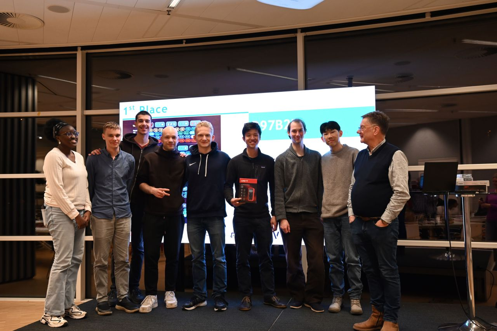
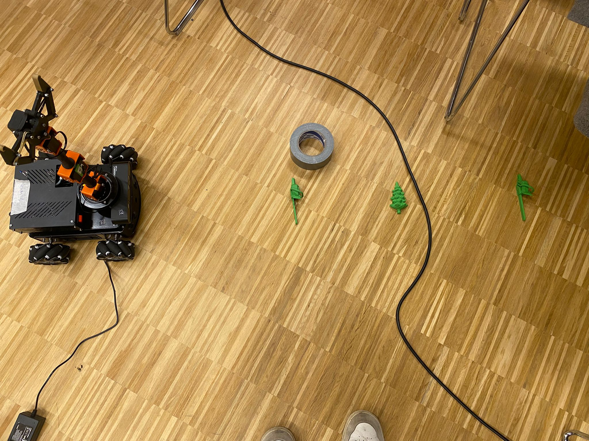
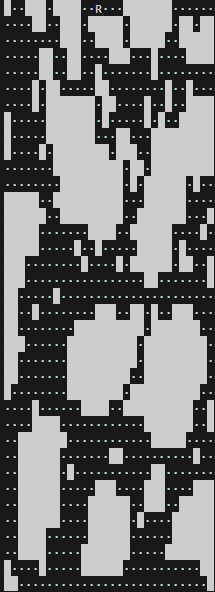
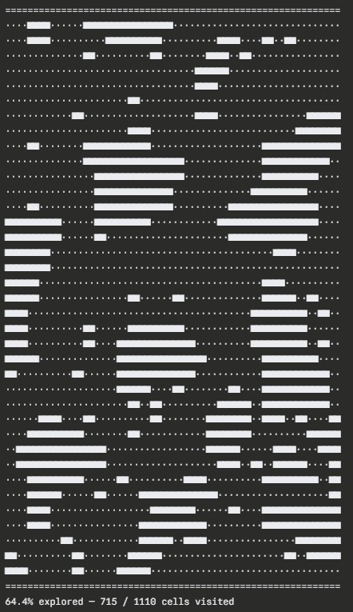
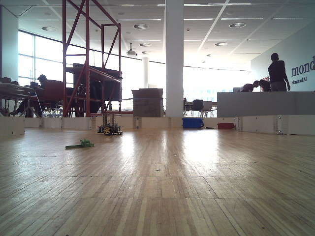

# TU Delft Swarm Robotics Hackathon 2026 — Team D97B27 (1st Place)



**Winners** of the TU Delft Swarm Robotics Hackathon, RoboHouse, Delft, March 2026.

A **4-robot MIRTE swarm** solving a disaster-response simulation: **3 Pioneer scouts + 1 Master with a gripper**. The arena contains AprilTag-marked objectives; Pioneers explore in parallel and build a shared free-space map, the Master plans across that map and executes autonomous pickup + delivery.

We were **the only team of five to implement autonomous pickup**, which scored +0.5 pts per delivery per the challenge spec — the decisive margin.

---

## Architecture at a glance

```
┌──────────────┐                     ┌──────────────────────┐
│  Pioneer ×3  │ ──map cells───────▶ │  Server (overhead    │
│  (scouts)    │ ──discoveries────▶  │  AprilTag tracker +  │
│              │ ◀──global poses──── │  message relay)      │
└──────────────┘                     └──────────┬───────────┘
                                                │
                                  ┌─────────────▼──────────────┐
                                  │  Master (gripper-equipped) │
                                  │  ┌───────────────────────┐ │
                                  │  │ Global Navigator      │ │
                                  │  │  · A* on shared       │ │
                                  │  │    free-space map     │ │
                                  │  │  · Mecanum holonomic  │ │
                                  │  │  · Camera-lost recov. │ │
                                  │  └───────────┬───────────┘ │
                                  │              ▼             │
                                  │  ┌───────────────────────┐ │
                                  │  │ Nested FSMs:          │ │
                                  │  │ Pick-Up  · Drop-Off   │ │
                                  │  │ with retry + verify   │ │
                                  │  └───────────────────────┘ │
                                  └────────────────────────────┘
```

**One-paragraph summary:** Three Pioneers explore the arena with randomized traversal + ultrasonic obstacle avoidance, logging every safely-traversed cell to a shared free-space map. The Master receives both AprilTag-objective discoveries and live map updates, then plans a global path with A* over the collectively-built map, executes mecanum-holonomic motion under overhead-camera localization with safe-stop on camera loss, and runs nested pickup/drop-off state machines with retry-and-verify. After delivery, it returns home and waits for the next objective. No direct peer-to-peer ROS communication — the shared spatial data is the coordination layer.

See [`docs/ARCHITECTURE.md`](docs/ARCHITECTURE.md) for the technical deep dive.

---

## Why we won

- **Autonomous pickup** — the +0.5 pt-per-delivery edge that no other team implemented. Built as a discrete FSM with retry-and-verify (3 attempts), runs end-to-end without operator input.
- **Hybrid sensor fusion** — overhead-camera AprilTag pose for global navigation, onboard odometry handoff for the final close-range approach where camera precision drops. Same pattern as spacecraft AOCS (coarse star tracker → fine gyro integration).
- **Emergent map quality** — three Pioneers traversing in parallel produce a richer free-space map than any single robot could. The Master always plans against the latest shared state.
- **Decoupled architecture** — exploration and manipulation are fully independent. Pioneers keep refining the map while the Master executes, with no blocking or role coordination.
- **Reliable comms protocol** — custom binary messages over the shared server (`struct.pack` of map-cell updates and objective broadcasts), low bandwidth, predictable parsing.

---

## Calibration & mapping artifacts

| | |
|---|---|
|  | **Camera-to-floor calibration.** Top-down view: Master (left), three green tree-objectives, and a grey tape roll as scale reference. Used to set HSV thresholds and the camera-height / FOV constants (`H_CAMERA=13 cm`, `V_FOV=40°`, `H_FOV=62°`) experimentally on-site. |
|  | **Pioneer-built occupancy grid (run end).** Bayesian log-odds map produced from LIDAR scans. White = free, black = unknown/occupied, `R` = Pioneer pose. This is what was fused into the Master's planner. |
|  | **Coverage progress visualization.** 64.4% of arena cells explored (715 / 1110) at run end — the kind of telemetry Pioneers logged during runs for our own debugging. |
|  | **Master's detector POV.** What the green-object HSV filter sees during the pickup state machine's `detect` phase. |

---

## Hardware & runtime

- **Platform:** MIRTE robots (TU Delft RoboHouse), Mecanum holonomic drive, 4-DOF gripper arm, onboard RGB camera (640×480), 360° LIDAR, wheel odometry
- **Stack:** ROS 2 (rclpy), Python 3, OpenCV, NumPy
- **Multi-robot infra:** server-mediated message bus + overhead-camera AprilTag tracker (provided by hackathon organizers)
- **Vendored:** `hakaton/mirte-python/` — MIRTE robot library fork

---

## Running

> The code is tightly coupled to the hackathon-day MIRTE environment (server address, team credentials, arena map). It will not run standalone — it is published here as a record of the winning solution.

Entry points:
- `hakaton/code/everything/hackathon_2.py` — Master orchestrator (final version, uses `WaypointNavigator` + ultrasonic obstacle avoidance)
- `hakaton/code/everything/hackathon.py` — Master orchestrator (v1, uses `GlobalNavigator` + A* on inflated map)
- `hakaton/code/everything/test_simple_comms.py` — interactive REPL for debugging Master nav + Pioneer map-update reception

Helper modules of interest:
- `navigate_master.py` — `GlobalNavigator` (A* on shared map, mecanum execution, camera-lost recovery)
- `waypoint_navigator.py` — later iteration adding ultrasonic obstacle avoidance
- `path_planner.py` — `AStarPlanner` with polygon-inflation
- `align_objective.py` — odometry-based fine alignment (the camera→odometry sensor-fusion handoff)
- `map.py` — Pioneer-side Bayesian log-odds occupancy grid from LIDAR scans
- `test_all.py` — `PickupStateMachine` (autonomous pickup with retry+verify) — **the win condition**

---

## Repo layout

```
.
├── README.md                          ← this file
├── LICENSE                            ← MIT
├── docs/
│   ├── ARCHITECTURE.md                ← technical deep dive
│   └── images/                        ← podium, calibration, mapping, detector POV
└── hakaton/
    ├── code/everything/               ← Master + Pioneer code
    ├── mirte-python/                  ← vendored MIRTE library
    ├── some.json                      ← captured detection-contour calibration
    ├── positions.sh                   ← ROS 2 trajectory commands for arm
    ├── npy2png.py                     ← utility: convert .npy frames to PNG
    └── main.py                        ← (empty — placeholder)
```

---

## Team D97B27

7-person team from TU Delft / THUAS. Hackathon was time-boxed; code was developed jointly across the team in a shared working tree, with subsystem ownership distributed:

- **Gleb Baburin** — Team Leader, Master Gripper subsystem, autonomous pickup state machine, sensor-fusion handoff (camera→odometry), Master navigation integration
- **Oleksandr Viun** ([@Oleksandr-Viun](https://github.com/Oleksandr-Viun)) — repo host, contributions across the stack
- Additional team members contributed Pioneer exploration logic, mapping pipeline, vision tuning, and arena calibration

This repo is published as the team's record of the winning solution.

---

## License

MIT — see [LICENSE](LICENSE).
